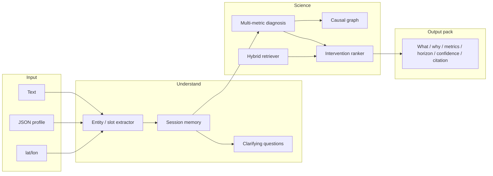

# BioIntel — Darukaa Biodiversity Intelligence Engine

An **AI environmental scientist**, not a chatbot wrapper.

BioIntel diagnoses a land system across soil, climate/water, habitat, and human pressure, retrieves a curated scientific corpus, and only then ranks interventions. Every recommendation carries a mechanism, the metrics it moves, a time horizon, a confidence band, and a citable source (FAO, IPCC, IPBES, *Science*, *Nature*, *PNAS*, and related primary literature).

It will **refuse** a generic answer when soil, climate, and land use are not all present — the brief’s own example (“Biodiversity is declining on my land”) triggers clarifying questions, not slogans.

## Why this is not an LLM-only app

| Layer | What it does | LLM needed? |
|---|---|---|
| Structured knowledge | 14 interventions with effect sizes, applicability rules, caveats, citations | No |
| Causal graph | Directed soil ↔ water ↔ habitat ↔ human-impact links | No |
| Diagnosis | Climate-adjusted thresholds (e.g. SOC 0.3% is *critical* in semi-arid cropland, not merely “low”) | No |
| Hybrid RAG | TF-IDF + LSA vectors fused with BM25 (reciprocal rank fusion) over a scientific corpus | No |
| Dialogue memory | Session land-profile that accumulates across turns | No |
| Composer | Deterministic scientific write-up from the recommendation pack | No |
| Optional LLM | Phrase-only polish; forbidden from adding unsourced practices or numbers | Optional |

The language model, if you attach an API key, never becomes the knowledge base.

## Architecture



### Data / schema

Persistent files (no external database required):

- `data/knowledge/interventions.json` — actionable practices with quantified effects
- `data/knowledge/thresholds.json` — climate-adjusted redlines (SOC, pH, native cover)
- `data/knowledge/causal_links.json` — signed mechanistic edges
- `data/knowledge/corpus/*.md` — indexed scientific notes with citations
- `data/index/lsa.joblib` — vector index (built on first run)
- `data/sessions/*.json` — conversation + land-profile memory

Land profile (Pydantic) groups the variables the brief requires:

- **Soil health** — SOC %, pH, moisture, texture, erosion
- **Climate** — rainfall class / mm, temperature, drought risk, zone
- **Land use** — type, crop, management, tillage, irrigation
- **Biodiversity indicators** — species richness, habitat diversity, native cover, pollinators
- **Human impact** — pollution, deforestation, fragmentation, pesticides, grazing
- **Geo** — lat/lon, region, elevation

### Retrieval pipeline

1. Chunk the corpus and fit a **domain TF-IDF + Truncated SVD (LSA)** embedding space. This is a real vector index, trained on *this* literature, with no giant model download.
2. At query time, embed the land profile + user wording; score **cosine(LSA)** and **BM25**.
3. Fuse ranks (RRF). Deduplicate by source document.
4. Filter the intervention library with applicability rules (e.g. do not push dense cover crops on true arid land; do not lime an alkaline soil).
5. Score remaining interventions by how many **limiting factors** they hit, how many metrics they move, and dryland/monoculture priors.
6. Return the top complementary three — not three flavours of the same idea.

Retrieved snippets are attached to the API response so a reviewer can see grounding, not just prose.

### Multi-metric reasoning

Diagnosis does not treat SOC, rainfall, and monoculture as a list. It walks the causal graph, for example:

**low rainfall → soil moisture → species survival**  
**SOC 0.3% → failed aggregation → lost infiltration → even less plant-available water**  
**monoculture wheat → floral dearth + simple canopy → pollinators and birds collapse**

The brief’s worked example therefore does **not** answer “add fertilizer.” It ranks water-harvesting, perennial structure (agroforestry / FMNR), and breaking the wheat monoculture, with FAO / Poeplau & Don / IPCC / Jose numbers attached.

## Quick start

```bash
python3 -m venv .venv
source .venv/bin/activate
pip install -r requirements.txt
export PYTHONPATH=.
python -m src.api.main
```

Open [http://127.0.0.1:8000](http://127.0.0.1:8000).

Optional:

```bash
cp .env.example .env   # LLM_API_KEY only if you want phrasing polish
python scripts/ingest.py
pytest -q
```

Docker:

```bash
docker compose up --build
```

### Structured assess

```bash
curl -s http://127.0.0.1:8000/api/assess \
  -H 'Content-Type: application/json' \
  -d '{
    "soil": {"organic_carbon_pct": 0.3},
    "climate": {"rainfall": "semi-arid"},
    "land_use": {"type": "cropland", "crop": "wheat", "management": "monoculture"},
    "geo": {"region": "semi-arid"}
  }'
```

Geo bonus: send `"coordinates": [-1.29, 36.82]` on `/api/chat`. The engine pulls 2020–2023 climate normals from Open-Meteo (no API key) and classifies the rainfall regime.

## API

| Method | Path | Purpose |
|---|---|---|
| POST | `/api/chat` | Text and/or JSON, multi-turn (`session_id`) |
| POST | `/api/assess` | Structured `LandProfile` |
| GET | `/api/session/{id}` | Memory dump |
| GET | `/api/knowledge` | Corpus + intervention catalogue |
| GET | `/api/health` | Index statistics |

Each recommendation in the pack includes: **what to do**, **why it works**, **impacted metrics**, **time horizon**, **confidence**, **evidence**.

## CI/CD

GitHub Actions (`.github/workflows/ci.yml`) installs Python 3.11 and runs `pytest` on every push. Tests cover:

- slot filling from the brief’s free-text and JSON examples
- clarifying questions when inputs are incomplete
- climate-adjusted SOC diagnosis
- multi-metric, cited recommendation packs
- the HTTP assess path

Deploy the same container to Railway, Render, or Fly.io (`Procfile` + `Dockerfile`). Set `PORT` if the host injects it.

## Project layout

```
src/engine.py                 orchestrator
src/knowledge/                corpus loader, LSA index, hybrid retriever
src/reasoning/                diagnosis, causal graph, intervention ranking
src/conversation/             extractor, clarifying questions, session memory
src/geo/climate.py            lat-band + Open-Meteo normals
src/llm/synthesizer.py        grounded renderer (+ optional polish)
src/api/main.py               FastAPI
frontend/                     scientific workbench UI (not the product)
data/knowledge/               the actual knowledge base
tests/                        reasoning + API contracts
```

## What “best” means against the rubric

1. **Depth of reasoning (30%)** — limiting-factor diagnosis, coupled causal chains, complementary intervention sets, explicit caveats (cover-crop water competition, no-till herbicide traps, overliming).
2. **Scientific grounding (25%)** — claims tied to named papers and assessments, not “studies show.”
3. **Knowledge system (20%)** — inspectable JSON + vector index + retrieval traces in the response.
4. **Conversational intelligence (15%)** — slot-filling memory; will not invent a farm.
5. **Output clarity (10%)** — structured pack + workbench that shows profile, meters, evidence, and graph.

Built for the Darukaa.Earth AI Biodiversity Intelligence Chatbot Challenge.
